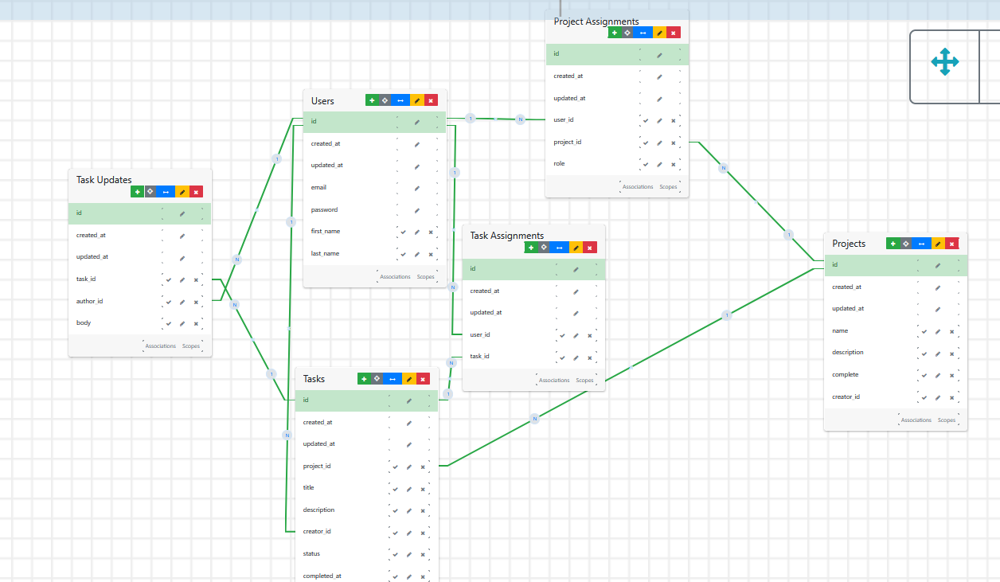

# Bordu
Bordu is an app that makes communication easy! Users create projects and associated tasks, then provide updates on task progression by simply responding to an email. It's the kanban for everyone!™️


## Table of Contents
1. [Features](#features)
   - [Coming Soon](#coming-soon)
2. [Getting Started](#getting-started)
   - [Prerequisites](#prerequisites)
   - [Installation](#installation)
   - [Email](#email)
     - [Sending Email In Development](#sending-email-in-development)
     - [Receiving Email In Development](#receiving-email-in-development)
     - [Email Setup For The Curious](#email-setup-for-the-curious)
       - [Action Mailer](#action-mailer)
       - [Action Mailbox](#action-mailbox)
3. [APIs](#apis)
4. [Contribution Guide](#contribution-guide)
5. [Contact](#contact)
6. [ERD](#erd)

## Features
- **Project Creation and Tracking** — Users can create projects with as many tasks as they like, and keep track of their progress by completing task after task.
- **Task Tracking** — Tasks have four categories: unassigned, assigned, in progress, and complete.
- **Email Updates** — When users are assigned a task, all they have to do is reply to an email to update managers on their progress.

### Coming Soon
I have a lot of work that's still ongoing on this project. You can track my progress with Bordu's functionality on its [Github Project board](https://github.com/users/brvarner/projects/1/views/1).

- [ ] **AI Summary** — I hope to implement AI summaries of current tasks and their progress so users can get a sense of what's going on without having to click through each task.
- [ ] **Organizations** — Eventually I'll implement organizational ownership of projects to ease collaboration.
- [ ] **Slack and Text** — I want to allow the app to send and recieve text updates, and to allow updates to come in via Slack to make it even more accessible.
- [ ] **Mobile App** — I'm planning to build a React Native app for Bordu eventually, that'll probably be its own repository. First, I'm going to make a PWA.
- [ ] **Attachments** — I'm planning to support several types of attachments for updates. For example: PDF, images, CAD, and eventually more niche attachments like DICOM and STL.

## Getting Started

### Prerequisites
1. Ensure you have at least Rails 7.1.3.4 installed.
2. Ensure you have at least Ruby 3.3.3 installed.
3. Ensure you have at least PostgreSQL 14.12 installed.
4. Ensure you have at least Bundler 2.5.14 installed.
5. (Optional) If you're running this on a Windows machine, you should set up WSL. [Here's a guide](https://gorails.com/setup/windows/10) on getting it running. I developed this app using WSL2 with Ubuntu 22.04.

### Installation
To start running Bordu, you just have to follow a few simple steps.

1. Clone this repo to your local machine with this command:
```bash
git clone https://github.com/brvarner/bordu.git
```
2. Navigate to the app directory in your terminal:
```bash
cd Bordu
```
3. Install the required Ruby gems if you've already installed bundler. Type this command into your terminal:
```bash
bundle
```
4. If you've got PostgreSQL installed, you can create the necessary tables by running these commands in your terminal:
```bash
rails db:create db:migrate
```

5. I highly recommend creating one or two accounts with real email addresses so that you can test the email functionality, so feel free to edit the file at `lib/tasks/sample_data.rake` to add yourself as a user.
```ruby
 User.create(
      email: "<your email>",
      password: "<your password>",
      first_name: "<a name>",
      last_name: "<another name>",
    )
```

6. Once you're satisfied with your account, run the sample data task.
```bash
rails sample_data
```

7. Start the Rails server.
```bash
rails s
```

8. Visit `http://localhost:3000` to view the application in your browser of choice.

### Email
The [Action Mailer](https://guides.rubyonrails.org/action_mailer_basics.html) and [Action Mailbox](https://edgeguides.rubyonrails.org/action_mailbox_basics.html) functionality in this app was tough. But it's easy if you just want to test the sending and receiving functionality locally. 

#### Sending Email in Development
If you're on a Mac or *nix computer, you can test the mail capability by installing the [letter_opener gem](https://github.com/ryanb/letter_opener). The repo has instructions for setup. 

Once you configure it, any email sent from Action Mailer will automatically load in the browser for viewing. 

If you're using WSL2, it probably won't work. In that case, you'll need to find another way.

#### Receiving Email in Development
If you want to test the action mailbox functionality, follow all setup instructions and then navigate your browser to:
```bash
http://localhost:3000/rails/conductor/action_mailbox/inbound_emails
```
There, you can send emails and watch your app process them in real time.

#### Email setup for the curious
You'll probably have to add [Rails Credentials](https://edgeguides.rubyonrails.org/security.html#environmental-security) to your project, so you need to get used to this command:
```bash
EDITOR="code --wait" bin/rails credentials:edit
```

This command summons VSCode from your browser and opens your credentials file. From there, you can add the necessary credentials. Then, you'll close the file, and it'll encrypt and save your new credentials. You can see the credentials with `rails credentials:show` if you have the same Master Key, you won't have the one to use my credentials bc it's never going to get pushed to GitHub.

#### Action Mailer
Action Mailer is how Rails sends emails. The following files and folders contain action mailer configuration:
- `app/models/task_assignment_observer.rb`
- `app/mailers/task_assignment_mailer.rb`
- `config/environments/development.rb`
- `config/environments/production.rb`
- `app/views/task_assignment_mailer/*`

You might have to change the configuration to get it to work on your local machine, as my Rails credentials in the `environments` files will be inaccessible for you. 

You may also have to sign up for your own mail service to send and receive email for this project. I used Mailgun, but Sendgrid, Postmark, and Mandrill all have built-in support from Rails. 

**Do NOT change the `reply_to` address in the task_assignment_mailer in `app/mailers`**. This app relies on the reply to address to link the replying user to the task they're providing updates on. If you change this, it'll ruin the app functionality.

#### Action Mailbox
Action Mailbox is how Rails receives and parses mail. This aspect of Rails can be very frustrating, and take a lot of time and energy. If you do have to set up your own mailbox to work on this project, know that I care deeply for you, and I will carry you in my heart through this endeavor.

I ended up using Mailgun because it was the most convenient for configuring Action Mailbox, so these instructions apply to Mailgun only.

The configuration for the Action Mailbox was half the battle, and it mainly lives in two places:

- `config/routes.rb` contains these two lines:
```ruby
 mount ActionMailbox::Engine => '/rails/action_mailbox'
  post '/rails/action_mailbox/mailgun/inbound_emails/mime' => 'action_mailbox/ingresses/mailgun/inbound_emails#create'
```
- `app/mailboxes/updates_mailbox.rb`.

If you've already got a mail service, you'll have to configure its inbound parse settings. The lines in the `routes.rb` file allow you to create a forwarding URL on Mailgun that can send incoming emails to your app.

The Action Mailbox guide above will walk you through setting up your mailbox for the big four mail services.

## APIs
Bordu is a very lean app (hopefully). As of now, the only API in the project beyond those added by Gems/Rails's native APIs is Mailgun's mail API for obvious reasons.

## Contribution Guide
If you'd like to add some functionality that you think would be cool for Bordu, feel free to do so! I'd love to see what you come up with.

Here's a quick guide to contributing:
1. **Fork the Repository** — Create your own fork
2. **Create a Branch**: For each new feature or bug fix, create a new branch based on the 'main' branch.
3. **Make Changes**: Implement your feature or bug fix.
4. **Document Changes**: Update the documentation to reflect any changes you've made.
5. **Submit a Pull Request**: Once your changes are complete, submit a pull request to the 'main' branch.

Be sure to check existing issues and pull requests before starting, as your ideal feature may already be in progress.

## Contact
Brandon Varner - [LinkedIn](https://www.linkedin.com/in/brandonvarneral/) • [GitHub](https://github.com/brvarner)

## ERD

